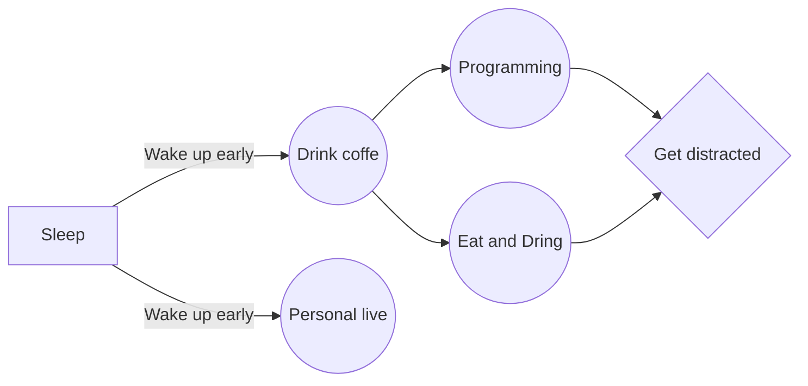

### Hi I'm Jaziel Isaí 👋

<!--
**JazielIsai/JazielIsai** is a ✨ _special_ ✨ repository because its `README.md` (this file) appears on your GitHub profile.

Here are some ideas to get you started:

- 🔭 I’m currently working on ...
- 🌱 I’m currently learning ...
- 👯 I’m looking to collaborate on ...
- 🤔 I’m looking for help with ...
- 💬 Ask me about ...
- 📫 How to reach me: ...
- 😄 Pronouns: ...
- ⚡ Fun fact: ...
-->

```javascript
  const = user {
    Name: 'Jaziel Isaí',
    Age: 21,
    Code: ["C#","JavaScript", "PHP", "SQL and MySql", "HTML", "CSS"],
    Tools: ["React", "Node.js"],
    School: "ITESI -> Intituto Tecnológico Superior de Irapuato",
    Links: {
      youtube: "https://www.youtube.com/channel/UCHDXr_nT0Gtjeqw2NVJQiPA",
      instagram: "https://www.instagram.com/isaigarrido",
      twitter: "https://twitter.com/Code_Isai",
      linkedin: "https://www.linkedin.com/in/dev-isa%C3%AD-garrido-3866a0228/"
    }
  }
```


Rutting of work

